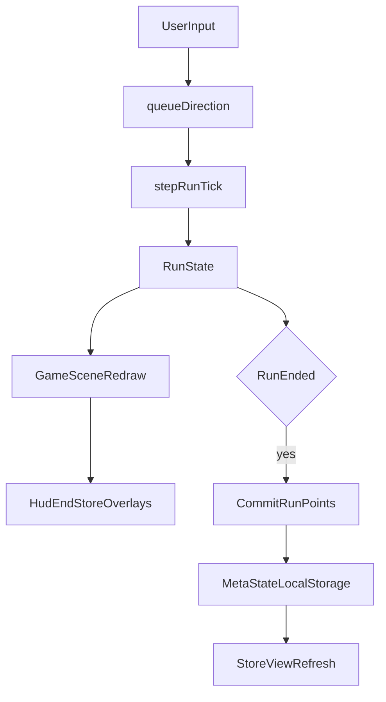

# Snake Architecture Map

## Core Principle

Keep game rules in `src/game/*` and orchestration/render/input in `src/scenes/*`.

## Module Responsibilities

- `src/game/types.ts`
  - Shared domain types for run state, meta state, entities, phases, deaths, and stats.
- `src/game/runState.ts`
  - Pure run progression logic: direction queueing, step tick, collisions, score changes, run endings.
- `src/game/spawnSystem.ts`
  - Spawn/update presence of entities on grid (currently orb-focused behavior).
- `src/game/boundary.ts`
  - Boundary rule resolver (`wall-kill` vs `wrap-around`) for movement outcomes.
- `src/game/visibility.ts`
  - Visibility utility used for fog and hidden entities.
- `src/game/metaState.ts`
  - Persistent progression lifecycle (`load`, `save`, upgrade checks, store item view models).
- `src/game/talentCatalog.ts`
  - Declarative talent catalog (title/description/levels/costs/availability/effect IDs by level).
- `src/game/effects/schema.ts` + `src/game/effects/engine.ts`
  - Run stat modifier schema and effect aggregation pipeline.
- `src/scenes/GameScene.ts`
  - Phaser scene wiring: render loop, HUD/end/store overlays, input wiring, run/meta coordination.

## Runtime Data Flow

## State Separation

- `RunState`: ephemeral state for one run.
- `MetaState`: persistent progression across runs.
- Store UI reads and mutates `MetaState`, while run loop mutates `RunState`.

## Extension Points

- Add gameplay effect: define in `effects/schema.ts`, bind via `talentCatalog.ts`.
- Add talent UI behavior: `metaState.ts` for rule checks + `GameScene.ts` for presentation/interactions.
- Add entities: extend `EntityKind` in `types.ts`, spawn logic in `spawnSystem.ts`, render path in `GameScene.ts`.
