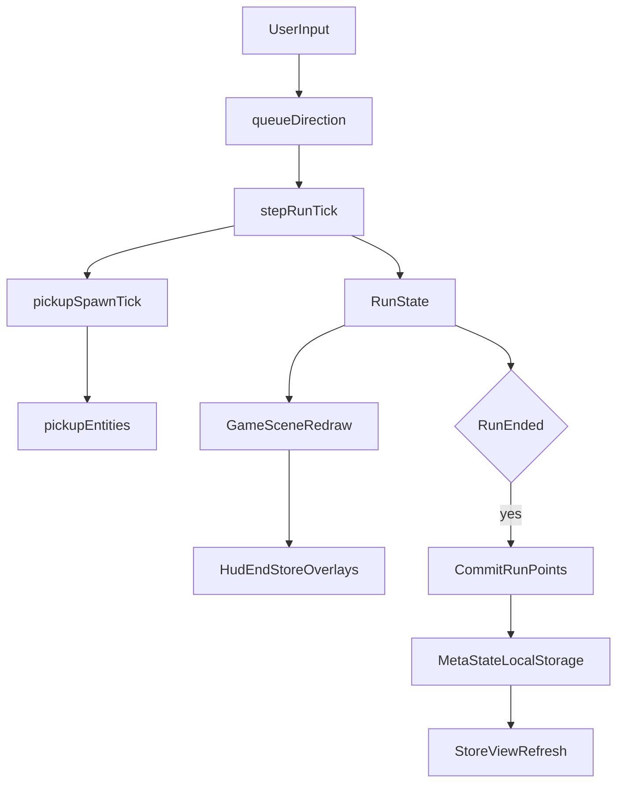

# Snake Architecture Map

## Core Principle

Keep game rules in `src/game/*` and orchestration/render/input in `src/scenes/*`.

## Module Responsibilities

- `src/game/types.ts`
  - Shared domain types for run state, meta state, entities, phases, deaths, and stats.
- `src/game/runState.ts`
  - Pure run progression logic: direction queueing, step tick, collisions, score changes by source, run endings, timed effect lifecycle.
- `src/game/spawnSystem.ts`
  - Spawn/update presence of entities on grid (orb + pickup spawns, including per-type cap rules).
- `src/game/pickupCatalog.ts`
  - Declarative pickup definitions (spawn chance source, per-type limits, collect behavior, visual token/color).
- `src/game/boundary.ts`
  - Boundary rule resolver (`wall-kill` vs `wrap-around`) for movement outcomes.
- `src/game/visibility.ts`
  - Visibility utility used for fog and hidden entities.
- `src/game/metaState.ts`
  - Persistent progression lifecycle (`load`, `save`, unlock checks, upgrade checks, store item view models).
- `src/game/talentCatalog.ts`
  - Declarative talent catalog (title/description/levels/costs/availability/effect IDs/unlock rules/store row ordering).
- `src/game/effects/schema.ts` + `src/game/effects/engine.ts`
  - Run stat modifier schema and effect aggregation pipeline (`orb_yield` boosts `orbPointsMultiplier`, `passive_income` boosts `passiveIncomePointsPerSecond`, `vision_bonus_orb` boosts pickup spawn chance, `no_walls` sets `boundaryMode` to `wrap-around`).
- `src/scenes/GameScene.ts`
  - Phaser scene wiring: render loop, HUD/end/store overlays, input wiring, run/meta coordination.

## Runtime Data Flow

## State Separation

- `RunState`: ephemeral state for one run.
  - Includes timed effects and pickup spawn accumulators.
- `MetaState`: persistent progression across runs.
- Store UI reads and mutates `MetaState`, while run loop mutates `RunState`.

## Points Pipeline

- Score gains are applied by source (`orb`, `passive_income`) inside run logic.
- Source multiplier and global multiplier are resolved in run stats (`orbPointsMultiplier`, `globalPointsMultiplier`).
- Fractional results are preserved in run state remainder before adding whole points to score.

## Pickup and Buff Pipeline

- Pickup spawn chances are read from `RunStats.pickupSpawnChancePerSecond`.
- Spawn rolls happen once per elapsed second with catch-up on delayed frames.
- Pickup cap is enforced per pickup type (`maxConcurrent`).
- Pickup collect actions can grant points and/or timed effects.
- Timed effects are additive on matching stats and expire independently.

## Test Coverage

Unit tests live next to the module they cover, as `src/game/*.test.ts`, and run on Vitest
(`npm test`). They cover pure logic only — anything that needs Phaser or the DOM is out of scope.

- `boundary.test.ts`: `wall-kill` vs `wrap-around` resolution on every grid edge.
- `effects/engine.test.ts`: stat aggregation, unknown-effect tolerance, per-pickup spawn chances.
- `runState.test.ts`: phase transitions, direction queueing and reversal guard, wall/self collision,
  life loss vs run end, timer expiry, orb scoring with multipliers, fractional point carry-over,
  timed-effect vision and speed resolution.
- `metaState.test.ts`: save loading and corrupt-save fallback, talent costs, unlock chains
  (`no_walls` then `speed_boost_pickup`), purchase side effects, level clamping, store view models.

Two things the suite deliberately does not prove:

- `GameScene.ts` is untested (rendering, HUD, store UI, input wiring). A green suite is not a
  substitute for one manual run check.
- Spawn placement is random. Tests park an orb in a known cell so `ensureOrbSpawn` bails out early,
  which keeps `stepRun` deterministic; do the same rather than stubbing `Math.random`.

## Extension Points

- Add gameplay effect: define in `effects/schema.ts`, bind via `talentCatalog.ts`.
- Add talent UI behavior: `metaState.ts` for unlock/upgrade rule checks + `GameScene.ts` for presentation/interactions.
- Add pickup: declare in `pickupCatalog.ts`, wire chance via `effects/schema.ts`, render via `GameScene.ts`.
- Add entities: extend `EntityKind` in `types.ts`, spawn logic in `spawnSystem.ts`, render path in `GameScene.ts`.
